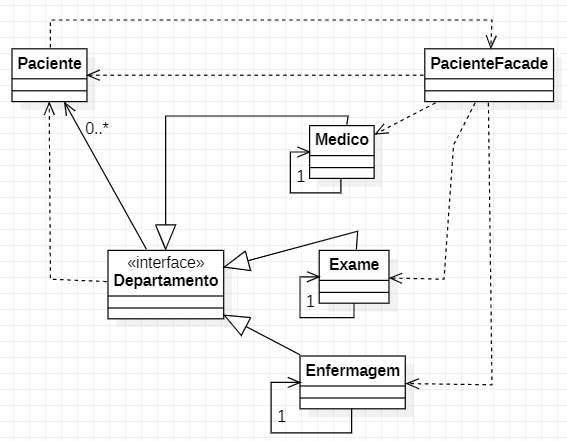

# Padrão Facade

Esconder implementações tendo apenas um ponto de acesso.  
O ponto principal com as agregações necessárias é o Facede.

**Caso de Uso**: Liberação de um paciente do hospital:
- Exames enviados ao paciente?
- Médico deu a liberação (alta)?
- Acompanhante presente para liberação?
- Enfermeiro disponivel para liberação?

